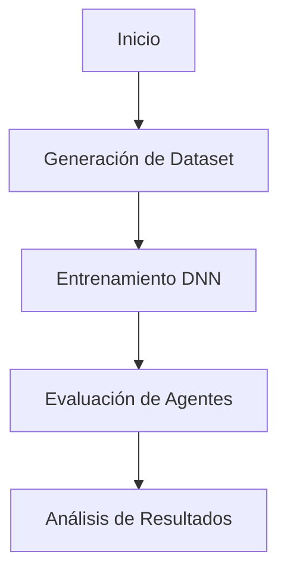

# Proyecto Briscas AI

**Asignación 5 – ICOM/CIIC5015 (AI)**
- **Autores:** Marco Yu Cordero, Samir Ali Rivera
- **Profesor:** Dr. J. Fernando Vega Riveros
- **Fecha:** 24 de abril de 2025
- **Documento asociado:** [Reporte_Asignacion_5_Briscas.pdf](./Reporte_Asignacion_5_Briscas.pdf)

---

## Índice
1. [Descripción del Proyecto](#descripción-del-proyecto)
2. [Arquitectura y Pipeline](#arquitectura-y-pipeline)
3. [Entorno y Requisitos](#entorno-y-requisitos)
4. [Fases de ejecución](#fases-de-ejecución)
   1. [1. Generación de Dataset](#1-generación-de-dataset)
   2. [2. Entrenamiento DNN](#2-entrenamiento-dnn)
   3. [3. Evaluación de Agentes](#3-evaluación-de-agentes)
5. [Uso y Flags](#uso-y-flags)
6. [Resultados Esperados](#resultados-esperados)
7. [Extensiones y Trabajo Futuro](#extensiones-y-trabajo-futuro)
8. [Referencias](#referencias)

---

## Descripción del Proyecto
Este repositorio contiene la implementación de agentes inteligentes para el juego de Briscas, siguiendo la **Asignación 5** del curso de Inteligencia Artificial (ICOM/CIIC5015). Se diseñan y comparan cuatro agentes:

- **Agente Aleatorio** (baseline)
- **Agente Heurístico** (modo estándar y agresivo)
- **Agente MCTS** (Monte Carlo Tree Search)
- **Agente DNN** (Deep Neural Network por imitación)

El objetivo es evaluar su desempeño en partidas de 2 y 4 jugadores bajo reglas estándar de Briscas. La metodología completa y los resultados detallados están en el PDF adjunto.

---

## Arquitectura y Pipeline


*Figura 1. Pipeline general del proyecto* (ver Sección 2.2.3 en el reporte)citeturn0file0.

---

## Entorno y Requisitos

# Step 1: Create venv
py -3.11 -m venv venv

# Step 2: Activate venv
.\venv\Scripts\Activate

# Step 3: Install packages
pip install -r requirements.txt

---

## Fases de ejecución

### 1. Generación de Dataset
Simula partidas MCTS vs Aleatorio para crear `data/X.npy` y `data/y.npy`.
```bash
python -m briscas.agents.dnn.generate_dataset
```

### 2. Entrenamiento DNN
Entrena la red neuronal con el dataset previo y guarda el modelo en `briscas/agents/models/briscas_dnn.keras`.
```bash
python -m briscas.agents.dnn.train_dnn_agent
```

### 3. Evaluación de Agentes
Ejecuta simulaciones para comparar los agentes (MCTS, Heurístico, Aleatorio, DNN) en modos normal y agresivo.
```bash
python -m simulations.run_simulation
```
Los resultados se guardan en `output/normal/` y `output/agresivo/`.

---

## Uso y Flags

```text
usage: run_simulation.py [-h] [--partidas N] [--iter_mcts I] [--c_mcts C] [--seed S] [--modo_agresivo]
```

- `--partidas N` : número de partidas por modalidad (default 500)
- `--iter_mcts I`: iteraciones MCTS (default 500)
- `--c_mcts C`   : constante de exploración (default 1.4)
- `--seed S`     : semilla base (default 42)
- `--modo_agresivo`: activa heurístico agresivo

Ejemplo:
```bash
python -m simulations.run_simulation --partidas 200 --iter_mcts 500 --c_mcts 1.4 --modo_agresivo --seed 123
```

---

## Resultados Esperados
Para **2 jugadores**, con `c=1.4` e `iteraciones=500`, se alcanza ~94 % de victorias de MCTS vs Aleatorio citeturn0file0. Para pruebas rápidas (±5 %):

| Agente       | % Victorias (2 jug.) | % Victorias (4 jug.) |
|-------------:|---------------------:|---------------------:|
| MCTS         | 94 % ± 5 %           | 60 % ± 5 %           |
| Heurístico   |  5 % ± 3 %           | 25 % ± 5 %           |
| Aleatorio    |  1 % ± 1 %           | 15 % ± 3 %           |

---

## Extensiones y Trabajo Futuro
- Integrar **PPO + self-play** (Deep RL) según Sec. 8.5 del reporte.  
- Probar arquitecturas avanzadas (CNN, LSTM, Transformers).  
- Migrar evaluaciones a **OpenSpiel** para comparabilidad.

---

## Referencias
- Russell, Norvig. *Artificial Intelligence: A Modern Approach*, 4th ed. 2021.  citeturn0file0  
- Reporte académico: `Reporte_Asignacion_5_Briscas.pdf` (este repositorio).
- Brown et al. “ReBeL: Imperfect‑information games”, NeurIPS 2020.
